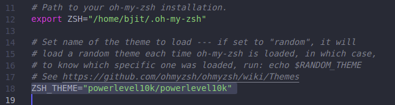
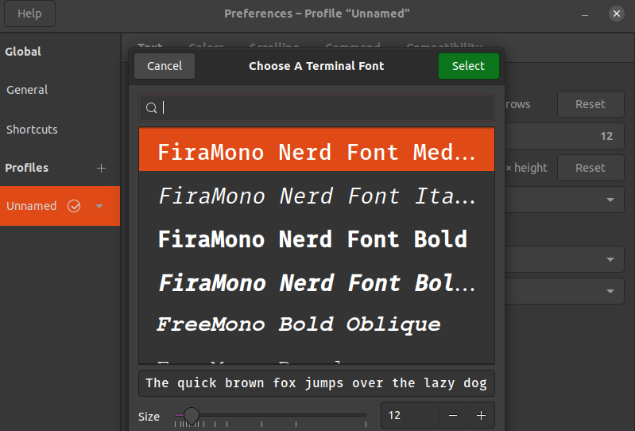
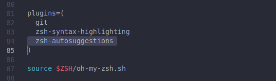
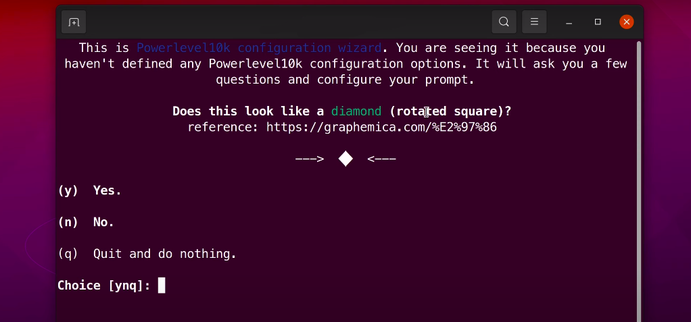
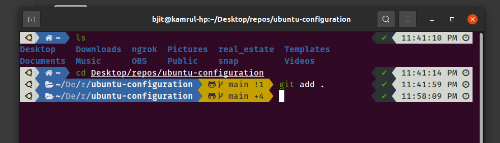

# Configure Ubuntu terminal

## Install vs code .deb file:

- [Official vs code](https://code.visualstudio.com/)

## Install curl:

```cmd
sudo apt install curl
```

## Install Oh My Zsh

```cmd
sh -c "$(curl -fsSL https://raw.githubusercontent.com/robbyrussell/oh-my-zsh/master/tools/install.sh)"
```

## Install Powerlevel10k

Clone the repository:

```cmd
git clone https://github.com/romkatv/powerlevel10k.git $ZSH_CUSTOM/themes/powerlevel10k
```

Then edit your `~/.zshrc` by using this cmd:

```cmd
code ~/.zshrc
```

and set `ZSH_THEME="powerlevel10k/powerlevel10k"`.



## Download this font and install:

- [Fira mono nerd font](https://github.com/KamrulSh/ubuntu-configuration/tree/main/fonts)

Set this font in Terminal (`Terminal → Preferences → Profiles → Text → Custom Font`), in the dropdown select the installed Font.



## Auto-suggestions:

1. Clone this repository into `$ZSH_CUSTOM/plugins` (by default `~/.oh-my-zsh/custom/plugins`)

```cmd
git clone https://github.com/zsh-users/zsh-autosuggestions ${ZSH_CUSTOM:-~/.oh-my-zsh/custom}/plugins/zsh-autosuggestions
```

2. Add the plugin to the list of plugins for Oh My Zsh to load (inside `~/.zshrc`):

```cmd
plugins=(
    # other plugins...
    zsh-autosuggestions
)
```



3. Start a new terminal session and configure by selecting options. Choose the correct option for completing the configuration.



4. And this is the final terminal.


